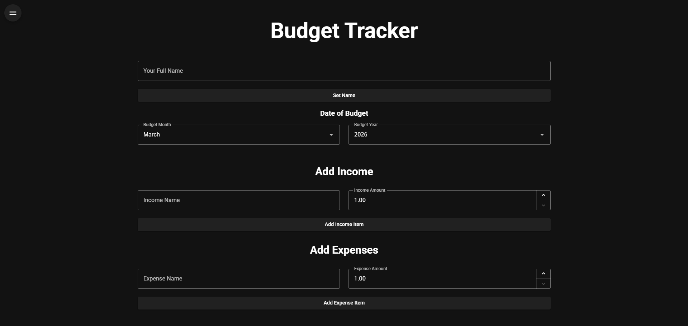
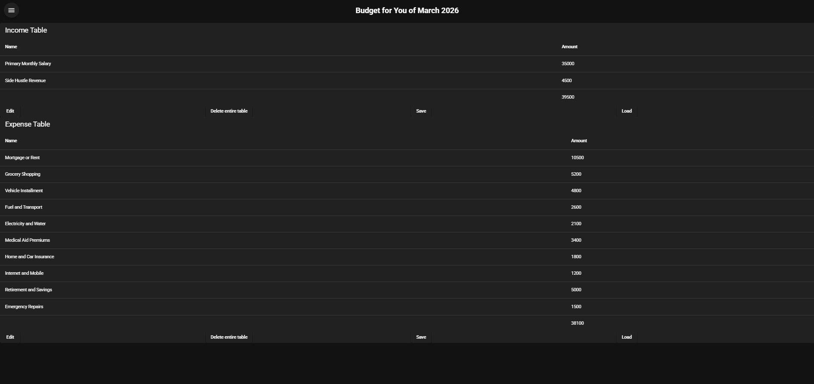
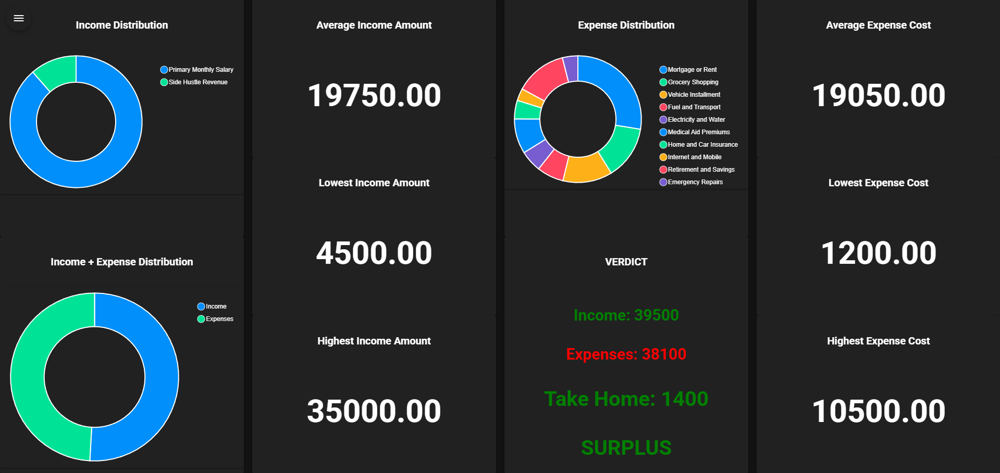

# 💰 ANALYTICAL BUDGET TRACKER

A budget tracker that allows you to record your income and expenses onto a table, and to visualize it via the Analytics

Link to live app: <https://analytical-budget-tracker.pages.dev/>

## BUDGET INPUT



### Enter your name

- It may only contain uppercase, lowercase and spaces, up to 20 characters, the regex for validating it is `^[a-zA-Z ]+$`
- Default name is 'You'

### Enter the date of your budget

- Enter the month and year the budget is based on
- The year ranges from 2000 to 2050

### Enter your income and expenses

- Again, the income/expense name may only contain uppercase, lowercase and spaces, up to 25 characters
- You may not enter an existing name (see the tables to be sure of this)
- The amount you are allowed to enter ranges from 1 to 1 000 000

## BUDGET TABLES



## Budget Info Text

- Contains your **name**, and **the date** of the budget
- Format: **Budget for [Your name] of [Date of budget]**

## Tables

- Has an income/expense name column, and the column for the amount

## Options

- These only affect the table above them

1. **Edit**
   - Toggle the Delete button on the tables to delete each individual entry on the table
2. **Delete entire table**
   - Deletes all entries
3. **Save**
   - Saves the entries into a JSON file to be loaded into the app again
4. **Load**
   - This loads in a JSON file to add entries seamlessly
   - If the JSON file has invalid contents, you will be notified
   - The correct format in TypeScript: [{name: string, amount: number}]

# Budget Analysis



## What is being analyzed

1. Income
   - Distribution: Overview of all sources
   - Average Income Amount
   - Lowest Income Amount
   - Highest Income Amount
2. Expenses
   - Distribution: Overview of all items
   - Average Expense Cost
   - Lowest Expense Cost
   - Highest Expense Cost
3. Income and Expenses
   - An overview of total income AND expenses amounts
4. Verdict
   - Lays out total income and expense amounts again
   - Shows how much money you would be left with
   - **SURPLUS (Dark Green)** - Leftover money > 0
   - **BREAKTHROUGH (Orange)** - Leftover money = 0
   - **DEFICIT (Red)** - Leftover money < 0

## Known Issues

- The loading function in the budgets table does not validate that the JSON is of the correct format, and only validates that it is valid JSON
- The loading function also does not validate that the strings are of the correct type according to the regex pattern, `^[a-zA-Z ]+$`

## 🧱 Stack

- Framework: Vue 3 + Vite
- UI Library: Vuetify
- Charts: ApexCharts
- Language: TypeScript
- Package manager: npm

## ✨ Enabled Features

- ESLint
- Pinia
- File Router

## 💿 Install

Use your selected package manager (npm) to install dependencies:

```bash
npm install
```

## 🚀 Quick Start

```bash
npm install
npm run dev
```

## 🏗️ Build

```bash
npm run build
```
